# Zero Da

> Because Balance Shouldn’t Be Zero, Da!

---

## Visual Feature Flow

```mermaid
flowchart TD
    A[Zero Da Features] --> B[Dashboard]
    A --> C[Analytics]
    A --> D[AI Interface]

    B --> B1[Balance Overview]
    B --> B2[Add/Delete Transactions]
    B --> B3[Transaction History]

    C --> C1[Expenditure Trends]
    C --> C2[Category Breakdown]
    C --> C3[Line Graphs]

    D --> D1[SMS Syncing]
    D --> D2[Spending Forecast]
    D --> D3[AI Insights]
    D1 --> D1a[Process SMS Messages]
    D1 --> D1b[Auto-create Transactions]
    D2 --> D2a[Predict Monthly Spend]
    D2 --> D2b[Budget Warnings]
    D3 --> D3a[Spending Habits]
    D3 --> D3b[Trend Analysis]
    D3 --> D3c[Forecasting]

    style A fill:#453596,stroke:#222,stroke-width:2px,color:#fff
    style B fill:#f3f0fa,stroke:#453596,stroke-width:1.5px
    style C fill:#f3f0fa,stroke:#453596,stroke-width:1.5px
    style D fill:#f3f0fa,stroke:#453596,stroke-width:1.5px
    style B1 fill:#fff,stroke:#bbb
    style B2 fill:#fff,stroke:#bbb
    style B3 fill:#fff,stroke:#bbb
    style C1 fill:#fff,stroke:#bbb
    style C2 fill:#fff,stroke:#bbb
    style C3 fill:#fff,stroke:#bbb
    style D1 fill:#fff,stroke:#bbb
    style D2 fill:#fff,stroke:#bbb
    style D3 fill:#fff,stroke:#bbb
    style D1a fill:#f8f9fa,stroke:#bbb
    style D1b fill:#f8f9fa,stroke:#bbb
    style D2a fill:#f8f9fa,stroke:#bbb
    style D2b fill:#f8f9fa,stroke:#bbb
    style D3a fill:#f8f9fa,stroke:#bbb
    style D3b fill:#f8f9fa,stroke:#bbb
    style D3c fill:#f8f9fa,stroke:#bbb
```



---

## Overview
Zero Da is a modern, AI-powered expense tracker and analytics platform. Track your income and expenses, visualize your spending, and get actionable AI insights—all in a beautiful, secure, and easy-to-use web app.

---

## Features
- Transaction Management: Add, view, and delete transactions with ease.
- Category Breakdown: Categorize transactions (Income, Groceries, Utilities, etc.).
- Visual Analytics: Interactive charts for trends and category breakdowns.
- AI Automation: Sync and process SMS messages to auto-create transactions.
- Spending Forecast: Predict your monthly spend and get budget warnings.
- AI Insights: Get smart, actionable insights on your spending habits.
- Modern UI: Responsive, clean, and consistent design across all pages.

---

## Tech Stack
| Component        | Technology                |
|------------------|---------------------------|
| Backend          | Node.js, Express, MongoDB |
| Frontend         | React, Vite, CSS          |
| AI Integration   | Google Gemini API         |

---

## Project Structure
```
ZeroDa/
  ├── backend/      # Express + MongoDB API + Node
  ├── frontend/     # React + Vite client
  └── README.md     
```

---

## Setup Guide

1. **Clone the Repository**
   ```bash
   git clone <repo-url>
   cd ZeroDa
   ```

2. **Backend Setup**
   ```bash
   cd backend
   npm install
   # Add your .env file (see below)
   node server.js
   ```

3. **Frontend Setup**
   ```bash
   cd frontend
   npm install
   npm run dev
   ```


---

## Sample .env Format (Backend)
Create a `.env` file in the `backend/` directory with the following format:

```
MONGODB_URI=your_mongodb_connection_string
GEMINI_API_KEY=your_gemini_api_key
```

- `backend/.env` is required for backend server to connect to MongoDB and Gemini AI.

---

## Security & Data Privacy
As this app involves sharing financial data with AI services, data security is a top priority. Always use secure API keys and never expose sensitive information in public repos.


- All sensitive keys should be stored in environment variables (`.env` files).
- Use HTTPS in production.
- Never share your database URI or API keys publicly.

---

**Made by Gaurav Mishra**
